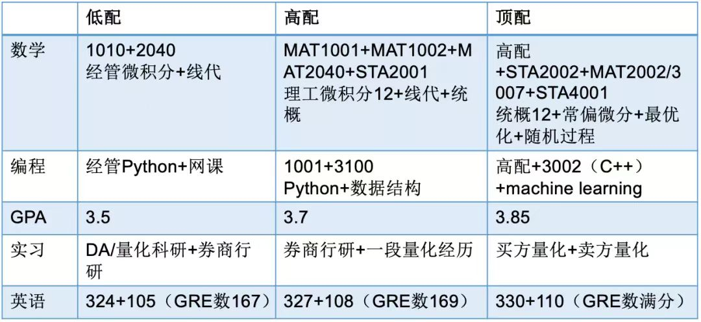

# Awesome-MFE

港中深美国 top MFE 项目申请指南

不定期更新，点击右上角 star 获取更新信息

申请有很多不确定性，祝大家申请顺利！

## 选校安排

基于 [Quantnet Ranking](https://quantnet.com/mfe-programs-rankings/)、录取者的背景、录取者的最终选择、项目近几年的去向，以及若干 top MFE 项目校友的综合评价，以下是个人美国 top MFE 项目的排名：

- Tier 0: Baruch MFE, Princeton MFin
- Tier 1: UCB MFE, CMU MSCF, Stanford MS\&E
- Tier 1.5: Columbia MFE, NYU Finmath, MIT MFin
- Tier 2: Columbia MAFN, Cornell MFE, UChicago FM
- Tier 3: NYU MFE, UCLA MFE, GaTech QCF

英国、新加坡、欧洲、香港等的一些热门项目：

- UK: Oxford MCF, LSE Finmath, IC RMFE
- Singapore: NUS MFE, NUS MQF, NTU MFE
- Europe: ETH MQF
- HK: HKU MFin, HKUST Finmath, CUHK RMDA

### 申请定位以及信息搜集

1. 项目官网：
  * pre-requisite, admission statistics, career report...
  * 最官方最整全
  * 从官网描述中感受项目风格

2. 可以参考各大 MFE 项目公布的录取学生的 resume book:

- [Columbia MAFN](resume_book/Columbia-MAFN/Columbia-finmath-2018.pdf)
- [NYU Courant FinMath](resume_book/NYU-Courant)
- [Princeton MFin](resume_book/Princeton)
- [UCB MFE](resume_book/UCB)

3. 学长学姐交流 - 同校学长学姐 & 该项目学长学姐 ｜ 领英，小红书
4. 一亩三分地 - 面经，项目评价，美国就业市场评价等
5. 小红书 
  * 信息很新,在准备Kira的时候可以先等等别人post题目
  * 较杂较碎片，小心中介制造焦虑
6. [Quantnet tracker](https://quantnet.com/tracker): - 全球的MFE application information.

## 申请时候的信息管理

* Notion - Information management
      * Easy to manage, update and share
      * [学长学姐整理好的模版](https://www.notion.so/Graduate-Application-Guide-f4cc3f5255c64b4a86d76460f93cfebd)

## 修课计划

建议上的课程：
- [量化水平提升：QTIA 修课建议](https://mp.weixin.qq.com/s/QLJxe6mqB6g_tmdvmpFJyA) （建议重点参考）
- 数学：微积分\*2，线代，最优化，概率论，常微分，偏微分，数学分析，数值分析/数值方法，随机微分等
- 统计：概率统计\*2，随机过程，随机模拟，时间序列，回归分析，统计推断，机器学习，深度学习等
- CS：Python，C++，数据结构，数据库等
- 金融经济：财务管理，微经，投资组合管理，期权期货，固定收益等

Credit to Songhao (MIT MFin)，仅供参考：

一些有用的资料链接：

- [申研课程背景提升：UCB MFE Checklist](https://mfe.haas.berkeley.edu/admissions/prerequisites)

## TOEFL & GRE

* TOEFL: 105+【口语高会有加成】
* GRE：155+ 170+ 3.5+ 【尽量早考】 

**GRE 经验分享帖**

- [Bradley Yang: GRE 162+170+4.5](https://www.zhihu.com/question/499380225/answer/2722956671)
- [Ben Li: GRE 166+170+3.5](https://zhuanlan.zhihu.com/p/448738149)
- [Eric Lan: GRE 164+170+3.5](https://zhuanlan.zhihu.com/p/386356094)

**托福口语tips分享三天速成23-27**

 - 保证语音语调的起伏和轻重音，尽量避免为了追求速度蒙头狂说
 - 流畅度比语法更重要，避免卡顿和突然说中文

## 推荐信：

  * 申请中的重要程度：对于MFE而言一般
  * 基本配置：2封学术（课程）推+1封实习导师推
  * 时间：建议大三暑假开始要，部分教授会有推荐信人数限制
  * 怎样要推荐信：
    * 上课积极发言/课后问问题给老师留下印象; 该课A/A-
    * 尽量挑有做project的课
    * 要推荐信前小心黑推
  * 列个表格方便及时更进
    
##  实习&科研
  * 实习
    * 国内私募：体量大小在申请委员会看来没区别，工作内容>公司
    * 外资：外资实习是一个有竞争力的点，即使岗位与quant不那么相关
        * 如何找实习？
          * 海投 | 实习僧，boss直聘，各大公司公众号，QTIA公众号，HFA公众号
          * 买方找实习成长路线：编程比赛/科研/小私募实习/卖方券商研报实习 -> 中等体量私募实习 -> 百亿私募实习

  * 科研
      * 方向：机器学习/深度学习/运筹优化等
      * 主要作用：体现research和coding的能力

    
## MFE 面试准备

以下列出部分 2024 fall 的 MFE 项目的面试内容（往后可能会调整）：

- Princeton MFin：Quant Assessment + 两轮真人面试（行为+技术）
- Baruch MFE：Quant Assessment + 两轮真人技术面
- UCB MFE：Kira 抽题录制（较固定） + 一轮真人技术面
- CMU MSCF：提前给题目三次录制机会 + 一轮真人行为面
- MIT MFin：录制两个 video，一个自行上传一个随机 Kira + 一轮 Quant Assessment (水) + 一轮真人行为面
- Columbia MFE：填完网申后跳出 Kira 面，三个行为面试题，一次准备+录制的机会
- Cornell MFE：填完网申后海发 Kira 面，五个行为面题，一次机会，无准备时间
- UChicago FM：三个 video 问题，时长要求不同，自行录制上传
- NYU Finmath：一个 5min 的长 video 录制上传
- NYU MFE：挑选一个指定问题并录制上传 video，无其他面试

### 行为面试

#### **机器面试**

面试形式常为：

1. 录制 video 上传
2. Kira 机器面试。录制比较简单基础，Kira 面试类似 TOEFL 的 Speaking 部分，绝大多数考察基础的口语表达能力，只要不是讲的太差都不会有太大问题。

总体的一些注意事项：

1. 注意着装，看镜头，不要读稿
2. 注意光线，环境安静，如果有后期空间可以自行调节亮度
3. 容易紧张或卡壳可以降低语速，并搭配手势

#### **真人面试**

真人行为面包括 CMU，MIT，GaTech 等，其内容风格和占比权重各异：
- CMU MSCF：淘汰型面试，大规模发面试，但是只选择少部分人录取。面试题目固定，在整个评核中占比不高
- MIT MFin：真人行为面占据绝对比重，面试官评核方式主观不可控，面试淘汰率超过 75%

此处重点介绍 MIT MFin 的面试准备 tips，部分内容 credit to Eddie (MIT MFin)：

1. 面试最重要的是展现你的energy，你需要足够自信
2. 注意房间的回音、收音、光线问题，本人就直接被面试官指出耳机有电流声（麻
3. 开场时面试官会习惯性的开一些small talk，不要过于紧张，让自己看起来自然一点
4. 对方大概率并不理解你简历里面的terminology，学会把专业性的东西用简单的语言表达
5. 描述一个project时，内容具体外，使用总分总的逻辑表达，并和soft skills挂钩
6. 注意面试的flow，适当的增添对话引导。能够逗笑面试官是一件很加分的事情

### 技术面试

以 Baruch MFE 和 UCB MFE 的技术面中考察的内容的难度和频率，对课程进行主观的分类，星越多表示技术面中越常见/重要：

- 微积分 ⭐⭐⭐⭐⭐：求导，隐函数求导，一元和多元积分，多元积分换元
- 线性代数 ⭐⭐⭐⭐⭐：特征值，trace，正定矩阵
- 概率 ⭐⭐⭐⭐⭐：期望，MGF，正态分布
- 期权 ⭐⭐⭐⭐⭐：BS 公式，Dividend 影响，Greeks，Convexity
- ODE ⭐⭐⭐⭐⭐: 一元二次齐次 ODE
- 编程 ⭐⭐⭐⭐：Python，Pandas，C++
- 回归分析 ⭐⭐⭐⭐：OLS回归，模型假设，异方差性
- Brain Teaser ⭐⭐⭐⭐：参考绿皮书和黄皮书，通常和概率一起考察
- PDE ⭐⭐⭐：如果没学过一般不会问
- 数值分析 ⭐⭐⭐：往年主要问 Newton method
- 机器学习 ⭐⭐⭐：有机器学习背景可能被问
- 时间序列 ⭐⭐⭐：学过这门课可能被问，如 ARMA 公式和原理
- Economics ⭐⭐：遇到过问对美国市场的了解的，道指和标普
- Live coding

**我们认为技术面考察的内容**：

* Reactions to one problem
  * Thinking patterns
  * Thinking perspectives
* Understanding of basic concept
* Communication ability
  * Make sure you fully understand the question. If not, ask immediately.
  * It’s ok to tell them you don’t know and ask for hint.
  * But make sure your thinking is a bit faster than the interviewees.
  * Tell them all your thinkings or even guesses about this problem and they will guide you.

* 记得写follow-up thank-you letter

#### UCB MFE

1. **校友面试**：UCB MFE的技术面试整体比较简单。面试官会根据你的背景寻找比较匹配的校友。比如如果你的ML经验比较多，就会偏向找机器学习工程师的校友面试你；如果你的背景是纯金融，那么他们也会找毕业后没做quant的校友，比如去KKR的校友面试你。
2. **面经和题目**：整体而言网上面经的参考价值不大，不同背景的问题从衍生品到机器学习到甚至fama-french factor model都可能问到。可以预料的是一些基础的线代、积分、衍生品的题目，只要都复习到了问题就不大，但是也有例外情况，比如本人就被考了一道算法题，并且给了三次hint都没有答出来…… 大概是从一堆0,1矩阵中寻找最大固定尺寸的子矩阵使得包含最多的1的方法，使用recursion求解。不过最后面试还是过了，因此不用太过担心这些比较偏门的题目。
3. **面试口音**：UCB很多的面试官是印度人，这就导致整体对话可能会进行的比较艰难，因此需要提前做好心理准备。本人当时就到了甚至需要在聊天框打出来说的是什么的地步了……

#### Baruch MFE

1. **QBA**：

  * No cutting edge
  * Only a tool for them to know you better
  * 时间：45分钟；形式：填空题；zoom中统一考试；[考点范围](https://mfe.baruch.cuny.edu/wp-content/uploads/2022/10/QBA-Review-Topics.pdf)
  * Open book, Open internet, Chatgpt is not allowed; 考完即出成绩
  * 考前会有专门说明会
  * 切记勿外传qba题目，一旦被发现直接拒

2. **第一轮**：

  * 第一轮不同的面试官的风格比较大。
  * 共同点：
    * 教授们人都很好，答不上来会一步一步带着你做题
    * 会在做题过程中注重基本概念的考察
    * 基本配置：(编程题) + 概率/数学题 + 期权题 + Q\&A
    * 结束的时候可以问是否会recommend 你
  * 建议复习方法：
    * 绿皮书+黄皮书
    * Calculus I \& II, Linear Algebra, Statistics等的过往课件 （因人而异）
    * 该教授在网上的面经和他写的书
  * 在第一轮第二轮申请批次中，你会提前知道面你的教授是谁；在第三轮第四轮申请批次中，你不会提前知道面你的教授
  * 面完之后不要在小红书上po面试的问题

3. **第二轮**:

  * 基本配置：c++概念题+概率/积分/线代/脑筋急转弯+（期权题）+ Q\&A
  * 建议复习方法：
    * 绿皮书+黄皮书 (黄皮的边角料注释也不要放过)
    * A Primer for the Mathematics of Financial Engineering (basic concept about Calculus)  \\ \& A Linear Algebra Primer for Financial Engineering
      * 基础概念和定理
      * 例子
    * Dan面经
  * Tips:
    * **建议尽早投递**。r3r4面题目明显比其他r1，r2的同学面试难很多。因此准备好了就尽早的投递。
    * **说清楚思路**。任何任何思路，想到就说，对错无所谓。如果Dan看到你的思路不对，可能会move on，也可能会给你一些hint。哪怕是最简单的，比如考虑一种特殊情况下的分类讨论，都会比什么都不说好。
    * 个人感觉Dan面试的时候比较亲切，语速还行，不用太害怕
    * **Think fast, move fast**。 面试时间只有30min，Dan不希望你坐在那里一直思考，他想过尽可能多的题目。因此，你需要给出非常快的feedback，并且根据他的hint及时的调整你的做法。
    * Dan喜欢把一些我们默认的“常识”问到底 - 准备的时候可以多问自己为什么
    * 提前准备Q&A问题 - 不要问他能不能被录取

#### Princeton MFE

1. Mandatory Math Assessment - 难度一般
Brain teaser, Linear Algebra, Ito’s Lemma, Calculus, probability & statistics

2. 第一轮：职业发展中心负责人行为面
  * 主要考察的内容：
    * 个人背景
      * why program? why quant finance?
      * introduce your internship at xxx company
    * 面对压力的临场反应
    * 语言表达能力
      * 将自己的各类经历灵活串联起来，切题回答
      * 分点回答，举例时说清楚起因经过结果
    * 偶尔会要求你介绍简历文书中出现的专业名词，小红书上有人反馈被问了 brain teaser & 数学题
  * 可以提前准备的内容
    * 文书，简历中的所有细节
    * 个人突出的品质/特点，优缺点
    * ethical dilemmas
    * 参考小红书，一亩三分地上的面经
  * 面试过程中最重要的
    * 自信的精神面貌
    * 迅速作出应答
    * 保持微笑 & 适当的手势

3. 第二轮：校友技术面
  * 因人而异，有的校友喜欢出题做，有的校友喜欢深挖简历。可以提前去领英了解校友的工作经历，作出针对性准备
  * 熟悉简历中每一项经历的技术细节
  * 准备好接受面试官对简历上经历的质疑
    * 回测方式是否严谨有效？
    * 是否满足模型假设？
  准备好被问到简历中提到的技术概念
    * what is xxx Model?

## 职业发展道路了解

- [Steven Shreve: Careers in Quantitative Finance](https://apply.mscf.cmu.edu/article/steve-shreve-industry-brief.pdf)
- [Emanuel Derman: My Life as a Quant](https://download.e-bookshelf.de/download/0000/5845/30/L-G-0000584530-0002384412.pdf)
- [QuantNet Threads: My Life as a Junior Quant](https://quantnet.com/threads/im-a-junior-buyside-quant-trader-ama.53762/)
- [QuantNet Threads: My Life as a Senior Quant](https://quantnet.com/threads/im-a-senior-buy-side-quant-researcher-ama.53587/page-2)
- [Buy-Side Quant Job Advice](https://www.reddit.com/r/quant/comments/1b2tnsi/buyside_quant_job_advice_by_giuseppe_paleologo/)